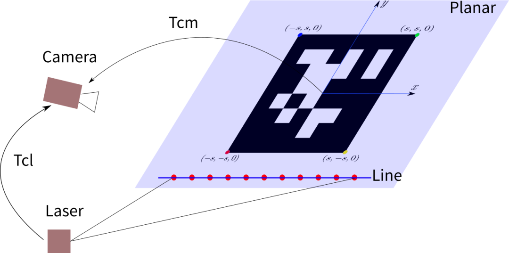
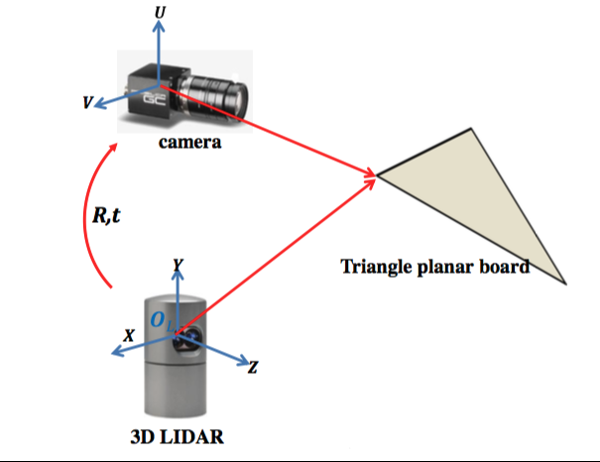
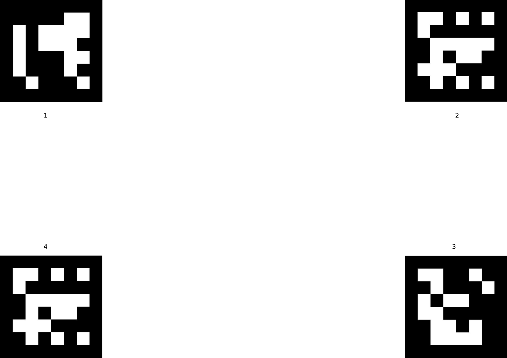
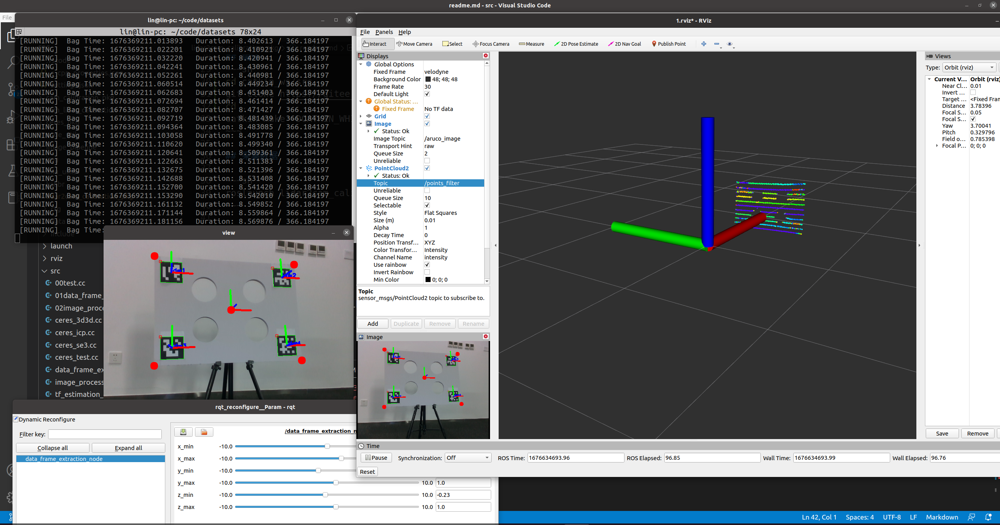

# lidar2cam_calibration简介

[docker环境部署](https://gitee.com/linClubs/lidar2cam_calibration/blob/master/data/marker_img/docker_env.md)

**谈谈写本工程的初衷**：网上也有不少激光雷达标定代码,我也git clone了不少,并编译成功。

但是在运行时，或多或少出现了很多问题，最常见的就是提不到特征，无法进行下一步，

索性自己缕了一遍原理,然后从零手写实现了标定程序。

[视频标定效果链接](https://www.bilibili.com/video/BV1g24y1W7Td/#reply153517451632)

**总结：还是本人太菜了,开源代码跑不通，只有笨比操作手撸^_^**

---

# 1 原理

$$
P_c = TclP_lidar
$$

标定出雷达到相机坐标系下的变换矩阵Tcl

---

**默认已经完成相机内参标定**

[未完成请移步到相机标定教程](https://gitee.com/linClubs/calibration_ros/tree/ros/)

+ 标定工作分为5步骤

1. 根据标定板尺寸,得到在标定板坐标系下三维坐标p_board
2. 根据二维码信息,得到标定板的像素坐标p_uv
3. 根据相机内参、p_board,p_uv计算得到,标记点在相机坐标下的坐标p_cam
4. 根据点云直通滤波分割平面、投影平面,得到标定板的点云平面,即雷达坐标p_lidar
5. 根据p_lidar，p_cam计算得到Tcl;
6. 优化Tcl。

---

# 2 准备工作

## 2.1 code env
**opencv-4.2(3.4.16也行),pcl-10.0, noetic,ceres1.14.0**

+ noetic安装后自带opencv-4.2 与pcl-1.10,
+ 装好**ros-noetic-desktop-full**后只需单独安装**ceres-1.14.0**
+ 本代码只在ros-noetic版本编译运行,直接用ros自带的opencv-4.2 与pcl-1.10版本,建议直接抄作业
+ ceres1.14.0优化库需要安装一下

+ ros功能包依赖,编译时缺啥装啥请自行安装
~~~sh
cv_bridge dynamic_reconfigure message_filters pcl_conversions pcl_ros roscpp rospy sensor_msgs
~~~

## 2.2 标定板制作

1. 代码生成4张aruco二维码
~~~sh
roslanuch lidar2cam_calibration create_aruco_node.launch
~~~

2. 直接网站生成[生成标定板网站](https://chev.me/arucogen/)

Dictionary: 6*6

Marker ID: 1，2，3，4 不要0

Marker size, mm: 100,边长可以不管,打印出来可能会变，直接改cfg/params.yaml中参数就行

3. 打印二维码

使用代码生成的aruco二维码可以放到office-word中,修改图像的尺寸,打印出来是1：1尺寸

生成4张aruco二维码,id分别为1，2，3，4，显示id=1的二维码：

4. 制作标定板

找个矩形的木板,依次贴上4张二维码,并记录二维码在木板上位置信息

位置信息在确定相机坐标系下坐标时需要用到,需要写入`params.yaml`中

---

# 3 标定

1. 编译

+ 装好**ros-noetic-desktop-full**与**ceres-1.14.0**后编译

~~~sh
cd catkin_ws/src
git clone https://gitee.com/linClubs/lidar2cam_calibration.git
cd ..
catkin_make -DCATKIN_WHITELIST_PACKAGES="lidar2cam_calibration"
~~~

2. 修改配置文件

修改`cfg/params.yaml`的参数,基本都有注释

+ 主要修改ArUco marker:相关的参数

3. 采集数据

~~~sh
roslaunch lidar2cam_calibration data_frame_extraction_node.launch
~~~

启动后,在rqt_reconfigure窗口下，调整x,y,z点云直通滤波的值

当激光点云只剩标定板时,移动鼠标到图像view窗口,按s键进行数据采集

尽可能多的采集数据,调整标定板位置,继续采集,建议采集10组以上不同的位姿的数据。

4. 求解Tcl
~~~sh
roslaunch lidar2cam_calibration estimation_tf_node.launch
~~~

---

# 4 docker脚本自动构建环境

+ 保证自己docker已经安装好了

1. 构建docker镜像

~~~python
./docker_build.sh
~~~

2. 宿主机可视化
~~~python
sudo apt-get --no-install-recommends install -y x11-xserver-utils
xhost +
~~~

3. 启动docker容器
~~~python
docker run -it -v /tmp/.X11-unix:/tmp/.X11-unix --env="DISPLAY=$DISPLAY" --network host --name=lidar2cam ros:1.0 /bin/bash 
~~~

4. 编译代码
~~~python
cd /catkin_ws
catkin_make
source devel/setup.bash
~~~

5. 启动采集数据程序
~~~python
roslaunch lidar2cam_calibration data_frame_extraction_node.launch
~~~

6. 估计外参程序
~~~python
roslaunch lidar2cam_calibration estimation_tf_node.launch
~~~

---

