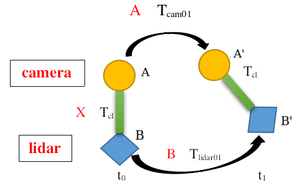
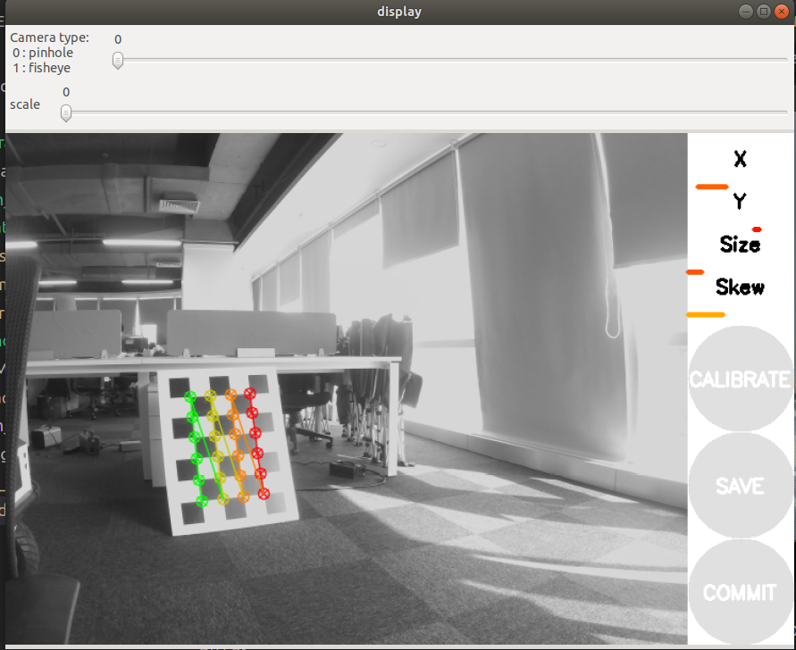

#  `Calibration Is All You Need`
 
This repository contains source code for Multi sensor calibration,including **camera、imu、imu2camera、lidar2cam、camera2camera、imu2lidar**.

# 0 原理简单介绍

这里只介绍外参标定原理

## 0.1 手眼标定

+ 外参标定不得不提手眼标定原理, 如图：

  

 + 上图表达了2个不同的传感器(camera和lidar)刚性连接，从t0运动到t1时刻的过程，红色A表示相机运动的姿态，红色B表示lidar运动的姿态，红色X表示lidar到camera的外参Tcl
 + 上图闭环中的黑色 $A$ 到黑色 $B'$ 的方式就可以有2条
 
$A$ -> $B$ -> $B'$ 和 $A$ -> $A'$ -> $B'$

$$
\begin{align*}
  &T_{AB'} = T_{AA'} · T_{A'B'} = T_{AB} · T_{BB'} \\
  &∵ T_{A'B'} = T_{AB}  \\
  &∴ T_{AA'} · T_{AB} = T_{AB} · T_{BB'} 
\end{align*}
$$

$$
\begin{align*}
记作：
&AX =XB
\end{align*}
$$

+ 求解 $AX =XB$ , 将欧式变换矩阵 $A、B、X$ 分解成R和t分开，也就是把方程化简, 得到

$$
\begin{align*}
&R_AR_x =R_xR_B \quad  \quad \   \quad  \quad     (1)\\ 
&R_At_x + t_A =R_xt_B + t_x   \quad  (2)
\end{align*}
$$

先求解(1)式，利用SO3的[伴随性质](https://v1otusc.github.io/2020/07/08/SO(3)-%E7%9A%84%E4%BC%B4%E9%9A%8F%E6%80%A7%E8%B4%A8/), 可以化简得：

$$
a = R_xb  \quad \quad \ \quad \quad \quad (3)
$$

$a$ 代表 $A$ 对应so3, $b$代表 $B$ 对应so3。

+ 个人理解：

$a,b$ 代表旋转向量。**物理意义：** $a$ 向量旋转 $R_x$ 就能得到向量 $b$

## 0.2 lidar2cam标定原理

+ 一般有利用标定板，并存在**传感器数据共视关系**, 如下图所示

  

1. 点约束

$$
P_c = TclP_lidar
$$

**直接找对应点**, 标定出雷达到相机坐标系下的变换矩阵 $T_{cl}$ 

+ 常见的求 $T_{cl}$ 做法还是利用**平面约束**

2. **平面约束**

相机系 $c$ 下的平面表示：法向量和一个D表示平面， 4个量表示一个平面

$$
\pi^c=\left[\mathrm{n}^c, d\right] \in \mathbb{R}^4
$$

$c$ 系外一点 $P_c$ 到平面的距离 $d$ ：

$$
\mathrm{n}^c{^T} P_c = d 
$$

2个向量的**点乘**，(一向量为单位向量)  结果就是另一向量在该单位向量上的投影(点到面的距离)

现在将雷达系 $p$ 下的点 $P_l$ 变换到 $c$ 系下 $P_c$ 表示：

$$
\mathrm{n}^c{^T}(T_{cl}*P_l) = d 
$$

**2d和3d激光都可以用平面约束求解 $T_{cl}$**。

[平面约束详细求解方法链接](https://github.com/linClubs/Calibration-Is-All-You-Need/blob/main/lidar2cam_calibration/readme.md)

## 1 环境配置
[环境构建详细参考](https://github.com/linClubs/Calibration-Is-All-You-Need/blob/main/Thirdparty/install.md)

1. `dependent install`

+ 本机保证`ubuntu-20.04，ros-noetic-desktop-full`完整版就行
+ `ros-noetic-desktop-full`自带 **`eigen-3.3.7, opencv-4.2.0, pcl-1.10`** 

~~~python
# 进入calibration目录
cd calibration

# 安装依赖
./dependent.sh
~~~

2. 推荐使用docker构建环境

~~~python
# 进入calibration目录
cd calibration

# 制作docker容器与镜像
./docker_build.sh
~~~

2. 编译`calibration`功能包

+ 下载
~~~python
mkdir -p catkin_ws/src
cd catkin_ws/src
git clone https://gitee.com/linClubs/calibration.git
~~~

+ 编译
~~~python
cd calibration
./build.sh
~~~
如果单独使用某一程序,可以单独打开`build.sh`,

复制编译代码块在**工作空间下**单独运行

---

# 2 相机标定

+ `kalibr`输出的内参格式为：`fx，fy，cx，cy`畸变参数为：`k1，k2，p1，p2`（径向畸变参数`k1、k2`，切向畸变参数`p1，p2`）

+ ROS标定工具直接输出了内参矩阵`K=[fx, 0, cx; 0, fy, cy; 0, 0, 1]`
  畸变参数为`[k1, k2, p1, p2, k3]`

+ `OpenCV`与`ROS`标定的畸变参数格式相同,采用的是五位畸变参数

与`ROS`标定的畸变参数格式相同。但是径向畸变的参数`k1、k2、k3`当中，`k3`的影响较小，`ROS`标定工具的输出中`k3`均为`0`.
所以在利用`Kalibr`标定后，直接在畸变参数中最后一位加`0`变成五位即可调用`OpenCV`校正。

## 2.1 `camera_calibration_py`

1. `env`
~~~python
apt get install python3-pip
pip install opencv-python==4.7.0.72 numpy==1.23.0
~~~

1. 进入代码工作空间
~~~python
cd src/calibration/camera_calibration_py/scripts
~~~

# 2.1.1 单目标定

1. 获得标定数据集

~~~python
python take_mono_img.py
~~~

2. 启动标定单目程序
~~~python
python mono_calibration.py
~~~

+  标定结果保存到`results/mono_calib.txt`目录下

包含**内参**、**重投影误差**

### 2.1.2 双目标定

1. 获得标定数据集
~~~python
python take_stereo_img.py
~~~

2. 启动标定双目程序
~~~python
python stereo_calibration.py
~~~

+  标定结果保存到`results/stereo_calib.txt`目录下

包含**内参**、**外参**、**重投影误差**

---

## 2.2 `ros`工具包`camera_calibration`

### 2.2.1 单目标定

1. env

~~~python
sudo apt install python3-catkin-tools
~~~

2. 只讲`usb`启动相机.下载`usb`相机

+ 其他相机一样,只需要提供`camera_info`与`image`话题

~~~python
cd catkin_ws/src
git clone https://github.com/ros-drivers/usb_cam.git
cd ..
catkin_make -DCATKIN_WHITELIST_PACKAGES="usb_cam"
~~~

3. 启动`usb_cam`
~~~python
roslaunch usb_cam usb_cam-test.launch
~~~

4. 下载`camera_calibration`

[image_pipeline](https://github.com/ros-perception/image_pipeline)该功能包里面的`camera_calibration`包行ros官方提供的单目，双目在线标定

使用时需要指定`CameraInfo`

~~~python
cd catkin_ws/src
git clone https://github.com/ros-perception/image_pipeline.git 
cd ..
catkin_make -DCATKIN_WHITELIST_PACKAGES="camera_calibration"
~~~

4. 启动标定程序

~~~python
source devel/setup.bash
~~~

~~~python
rosrun camera_calibration cameracalibrator.py --size 6x8 --square 0.025 image:=/usb_cam/image_raw camera:=/usb_cam/camera_info --no-service-check
~~~

~~~python
--size # 内角点数目 中间6小写的×8
--square 小方格边长, # 单位m
image:=/usb_cam/image_raw    # 图像话题名
camera:=/usb_cam/camera_info  # 相机话题名字
~~~

5. 启动上面代码后如图所示：

可以选择`camera type` ：针孔和鱼眼

右边有`3`个按钮，刚开始无法点击（灰色），

需要检测到棋盘格，并收集45张图片，可以再终端查看进程

`45`张收集完成了，就可以点击`calibrate`(绿色)了

开始标定，会卡一会，等待计算，完成后`save`按钮变绿色，点击，

+ 结果保存到`/tmp/calibrationdata.tar.gz`

### 2.2.2 [双目标定](http://wiki.ros.org/camera_calibration/Tutorials/StereoCalibration)

修改对面的话题名字，`size`和`square`,一般采用`ros`包发布数据

--`approximate` 选项允许相机校准器处理不具有完全相同时间戳的图像,当前设置为 `0.1` 秒。

在这种情况下，只要时间戳差异小于 `0.1` 秒，校准器就可以正常运行

~~~python
rosrun camera_calibration cameracalibrator.py --approximate 0.1 --size 8x6 --square 0.108 right:=/my_stereo/right/image_raw left:=/my_stereo/left/image_raw left_camera:=/my_stereo/left right_camera:=/my_stereo/right
~~~

侧边栏将显示棋盘正方形的测量精度和尺寸,`epi`精度(单位像素)`0.16`,`dim`为尺寸

通常，低于 `0.25` 像素的对极误差被认为是可以接受的，低于 `0.1` 的极佳。

---

# 3 `kalibr`标定相机

[csdn参考链接](https://blog.csdn.net/qq_34570910/article/details/103566490)
[官方教程不同ubuntu下安装教程](https://github.com/ethz-asl/kalibr/wiki/installation)

## 3.1 录制`ros`包

使用`kalibr`一般先录制`ros`包后，离线标定

[官方提供数据包](https://github.com/ethz-asl/kalibr/wiki/downloads)

+ `kalibr`在处理标定数据的时候要求**频率不能太高**，一般为`4Hz`，我们可以使用如下命令来更改`topic`的频率

+ `kalibr`经常出现标定失败的情况，主要原因在于移动标定板太快，需要**稳定在一定距离、缓慢移动**

1. 改变`topic`频率

~~~python
# rosrun topic_tools throttle messages 输入话题 频率 输出话题
rosrun topic_tools throttle messages <intopic> <msgs_per_sec> [outtopic]
~~~

~~~python
rosrun topic_tools throttle messages /camera/color/image_raw 4.0 /outtopic
~~~

2. 录制`topic`

测试采用[官方提供数据包](https://github.com/ethz-asl/kalibr/wiki/downloads),实际可以采用`rosbag`录制数据包

~~~python
rosbag record -O multicameras_calibration /infra_left /infra_right /color
~~~

## 3.2 `env`依赖

1. 下载编译`kalibr`的依赖

+ 参考 **`kalibr`** 目录下 **`Dockerfile_ros1_20_04`** 文件

+ `18.04`与`16.04`都可以参考`Dockerfile_ros1`文件
+ `libopencv-dev ,libeigen3-dev`两个依赖是源码编译得这里就不安装了

+ `Ubuntu 20.04`
~~~python
sudo apt-get install -y git wget autoconf automake python3-dev python3-pip python3-scipy python3-matplotlib ipython3 python3-wxgtk4.0 python3-tk python3-igraph libboost-all-dev libsuitesparse-dev doxygen libpoco-dev libtbb-dev libblas-dev liblapack-dev libv4l-dev python3-catkin-tools python3-osrf-pycommon
~~~

~~~
sudo apt-get install -y python3-dev python3-pip python3-scipy python3-matplotlib ipython3 python3-wxgtk4.0 python3-tk python3-igraph
~~~

## 3.3 编译

+ 编译
[不同ubuntu下安装教程](https://github.com/ethz-asl/kalibr/wiki/installation)

+ `ethz-asl/kalibr.git`版本

`Ubuntu 16.04-Ubuntu 20.04`都适用

~~~python
cd ~/kalibr_ws/src
git clone https://github.com/ethz-asl/kalibr.git
cd ~/kalibr_ws/
# 单独编译
catkin build kalibr -DCMAKE_BUILD_TYPE=Release -j4
~~~

## 3.4 标定

### 3.4.1 单目标定

[标定板github介绍](https://github.com/ethz-asl/kalibr/wiki/calibration-targets)

+ 棋盘格常用的,四月格精度高一点
+ 相机需要距离标定板`1-2m`，标定板占据视野`60%`以上,

由于`Aprilgrid`能提供序号信息，能够防止姿态计算时出现跳跃的情况。所以建议采用`Aprilgrid`进行标定

+ 标定过程中，标定板不要离开相机视野范围，开始和结束要平稳进行，尽量使标定板出现在视野所有角落。

1. 生成标定板`pdf`
+ `aprilgrid`四月格
~~~python
rosrun kalibr kalibr_create_target_pdf --type apriltag --nx 6 --ny 6 --tsize 0.088 --tspace 0.3
~~~

+ `checkerboard`棋盘格
~~~python
rosrun kalibr kalibr_create_target_pdf --type checkerboard --nx 6 --ny 6 --csx 0.03 --csy 0.02
~~~
内角点数目 `--nx 6 --ny 6`

+ [圆形格详情见](https://github.com/ethz-asl/kalibr/wiki/calibration-targets)

2. 标定板配置信息文件

四月格`aprilgrid.yaml`
~~~python
target_type: 'aprilgrid' # gridtype   标定板类型
tagCols: 6               # number of apriltags  大黑快数目
tagRows: 6               # number of apriltags
tagSize: 0.088           # size of apriltag, edge to edge [m]  单位m
tagSpacing: 0.3          # ratio of space between tags to tagSize
                         # example: tagSize=2m, spacing=0.5m --> tagSpacing=0.25[-]
                       # 实际上就是小黑块与大黑块的边长之比 example: tagSize=2m, spacing=0.5m, tagSpacing=0.25
~~~

3. 标定代码

~~~python
rosrun kalibr kalibr_calibrate_cameras --bag camera_calib.bag --topics /cam0/image_raw --models pinhole-radtan --target aprilgrid.yaml --bag-from-to 5 45
~~~

### 3.4.2 双目标定

1. 标定

+ 播放数据`imu_april.bag`

下载`IMU-CAM`数据包

`imu_april.bag`包含左右相机和`imu`话题

图像的参数：`height: 480`,` width: 752`

~~~python
rosbag play imu_april.bag

# 该数据集中的话题有：
/cam0/image_raw
/cam1/image_raw
/clock
/imu0
/rosout
/rosout_agg
~~~

+ 启动多目相机标定
~~~python
rosrun kalibr kalibr_calibrate_cameras --target april_6x6.yaml --bag imu_april.bag --models pinhole-equi pinhole-equi omni-radtan --topics /cam0/image_raw /cam1/image_raw /cam2/image_raw --bag-from-to 2 4
~~~

+ 上面`imu_april.bag`数据包为双目
~~~python
rosrun kalibr kalibr_calibrate_cameras --target april_6x6.yaml --bag imu_april.bag --models pinhole-radtan pinhole-radtan --topics /cam0/image_raw /cam1/image_raw --bag-from-to 5 45
~~~

### 3.4.3 相机与`IMU`标定

+ 录包
采集数据的起始和结束阶段注意别晃动太大，

如从桌子上拿起或者放下。如果有这样的动作，在标定阶段应该跳过`bag`数据集的首尾的数据.

采集数据的时候应该给imu各个轴足够的激励，

如先依次绕各个轴运动，运动完后来个在空中画8字之类的操作

当然也要注意别运动太剧烈，图像都模糊了。

~~~python
rosrun topic_tools throttle messages /camleft/video_image 4.0 /caml
rosrun topic_tools throttle messages /camright/video_image 4.0 /camr
rosbag record -O stereo_imu_calibra.bag /stereo_left_node/left  /stereo_right_node/right /imu_node/imu0
~~~

+ 启动
~~~python
source devel/setup.bash 
~~~

+ `camera.yaml`是由前面的`kalibr_calibrate_cameras`标定双目得到的
+ `imu.yaml`需要根据`imu_utils`标定结果修改
~~~python
rosrun kalibr kalibr_calibrate_imu_camera --target april.yaml --bag stereo_imu_calibra.bag --bag-from-to 5 50 --cam camera.yaml --imu ium.yaml --imu-models scale-misalignment --timeoffset-padding 0.1
~~~

+ `camera.yaml`文件内容如下:
~~~python
cam0:
  cam_overlaps: [1]
  camera_model: pinhole
  distortion_coeffs: [-0.1734857772863602, 0.026545178121976657, 0.0004291887376674085,
    -3.4873170616746686e-05]
  distortion_model: radtan
  intrinsics: [693.131838769146, 692.5498277671763, 616.3486206381017, 379.6677572220899]
  resolution: [1280, 720]
  rostopic: /stereo/left/image_raw
cam1:
  T_cn_cnm1:
  - [0.9999658061828064, 0.0005632950824424241, 0.0082504038578218, -0.11947602055948268]
  - [-0.0006621128372211408, 0.9999280240823567, 0.011979493367486592, 0.0004870068672051519]
  - [-0.008243062037729159, -0.011984546441186855, 0.9998942056912012, -0.0028910358303400464]
  - [0.0, 0.0, 0.0, 1.0]
  cam_overlaps: [0]
  camera_model: pinhole
  distortion_coeffs: [-0.17456713089475154, 0.027410444232267236, 0.0006360696559962682,
    -0.0002450168896166665]
  distortion_model: radtan
  intrinsics: [694.2107729740508, 693.480347118504, 617.3114354961933, 380.800130116761]
  resolution: [1280, 720]
  rostopic: /stereo/right/image_raw
~~~

+ `imu.yaml`文件内容如下
~~~python
#Accelerometers
accelerometer_noise_density: 5.43036e-03   #Noise density (continuous-time)
accelerometer_random_walk:   1.44598e-04   #Bias random walk

#Gyroscopes
gyroscope_noise_density:     4.9700e-03   #Noise density (continuous-time)
gyroscope_random_walk:       6.8522e-05   #Bias random walk

rostopic:                    /imu/data      #the IMU ROS topic
update_rate:                 100.0      #Hz (for discretization of the values above)
~~~

## 3.5 参数说明

~~~python
--bag:标定数据的名称
--topics:左右目相机的topic
--models:左右目相机模型
# pinhole-radtan: 最常见的针孔模型+布朗畸变模型(切径向畸变), 适用于大多数的角度小于120的相机, 其中畸变参数包含了径向畸变k1,k2和切向畸变p1,p2; 如果相机的畸变情况不是很严重,这个模型基本都可以; 比如我的DFOV为150的相机, 也可以用这个且去畸变效果很好;
# pinhole-equi:针孔模型＋等距畸变模型，也就是ＫＢ模型所需要选择的类型，该模型的使用范围也很广，大部分的鱼眼镜头也可以，注意8参数的ＫＢ模型的畸变参数为k1,k2,k3,k4，虽然也是四个数，但与前一个模型不同的是，这里只有径向畸变的参数，而没有切向畸变tangential distortion，投影时对应的公式也不同；同时这也是opencv中cv::fisheye使用的模型；
# omni-radtan全向相机模型+切径向畸变
--target:# 标定板参数配置文件
--show-extraction　# 是在标定过程中的一个显示界面，可以看到图片提取的过程，可以不要
--approx-sync # 时间同步容忍度，时间戳不对齐问题
--bag-from-to 5 45  # 5-45s的bag数据 ,单位秒
~~~

[`--models`参数官方说明](https://github.com/ethz-asl/kalibr/wiki/supported-models)

[`--target`参数官网说明](https://github.com/ethz-asl/kalibr/wiki/calibration-targets)

四月格`aprilgrid.yaml`
~~~python
target_type: 'aprilgrid' # gridtype
tagCols: 6               # number of apriltags
tagRows: 6               # number of apriltags
tagSize: 0.088           # size of apriltag, edge to edge [m]
tagSpacing: 0.3          # ratio of space between tags to tagSize
                         # example: tagSize=2m, spacing=0.5m --> tagSpacing=0.25[-]
                         # 实际上就是小黑块与大黑块的边长之比 example: tagSize=2m, spacing=0.5m --> tagSpacing=0.25
~~~

棋盘格`checkerboard.yaml`
~~~python
target_type: 'checkerboard' #gridtype
targetCols: 6               #number of internal chessboard corners
targetRows: 7               #number of internal chessboard corners
rowSpacingMeters: 0.06      #size of one chessboard square [m]
colSpacingMeters: 0.06      #size of one chessboard square [m]
~~~

`--bag` `ros`包

`--topics` 话题名,这里是`3`个话题名字,和`--models`对应也是`3`个

+ 校准将产生以下输出：

`report-cam-％BAGNAME％.pdf`：以`PDF`格式报告。包含所有用于文档的图。
`results-cam-％BAGNAME％.txt`：结果摘要为文本文件。
`camchain-％BAGNAME％.yaml`：结果为`YAML`格式。该文件可用作相机`imu`校准器的输入。

包含：
1.相机的重投影误差，`IMU`的误差（加速度和陀螺仪）可以作为先验误差来影响数据融合的定权问题
2.相机和`IMU`各自的标定参数，`2`个`.yaml`文件给的
3.`IMU`与相机之间的相对位姿标定（正反旋转矩阵）`cam1 to imu0`也有

~~~python
T_ci:  (imu0 to cam0): 
[[ 0.01680206  0.99985864 -0.00062288  0.06847911]
 [-0.99985871  0.01680236  0.00048881 -0.01472898]
 [ 0.00049921  0.00061458  0.99999969 -0.00376988]
 [ 0.          0.          0.          1.        ]]

T_ic:  (cam0 to imu0): 
[[ 0.01680206 -0.99985871  0.00049921 -0.0158756 ]
 [ 0.99985864  0.01680236  0.00061458 -0.06821963]
 [-0.00062288  0.00048881  0.99999969  0.00381973]
 [ 0.          0.          0.          1.        ]]

# 相机之间的位姿变换标定（基线）：
Baseline (cam0 to cam1): 
[[ 0.99999877  0.00118911 -0.00102243 -0.1101676 ]
 [-0.00118838  0.99999904  0.00071255 -0.00032166]
 [ 0.00102327 -0.00071134  0.99999922  0.00012079]
 [ 0.          0.          0.          1.        ]]
baseline norm:  0.110168134052 [m]
~~~

# 4 `IMU`

这里只标定IMU的噪声`noise`和偏置`bias`

+ `imu_utils`校准`IMU`的噪声密度和随机游走噪声

+ `imu`与相机联合标定参考`calibr`功能包
+ `imu`与雷达联合标定参考`lidar_align`功能包

1. 依赖和编译

+ `ros`与`ceres`参考其他章节

~~~python
sudo apt-get install libdw-dev
~~~

+ `code_utils`
~~~python
cd imu_ws/src
git clone https://github.com/gaowenliang/code_utils.git
cd ..
catkin build code_utils
~~~

+ `imu_utils`
~~~python
cd imu_ws/src
git clone https://github.com/gaowenliang/imu_utils.git
cd ..
catkin build imu_utils
~~~

2. 录制`rosbag`

+ 静止情况下采集IMU的数据，并录制为`ROS`包，我采集的时间为`2`小时`20`分钟
~~~python
rosbag record /imu/data -O imu_xsens.bag
~~~

3. 运行

+ 标定 配置`xsens.launch`文件为如下内容：(指定`IMU`的`topic`)
~~~yaml
<launch>
    <node pkg="imu_utils" type="imu_an" name="imu_an" output="screen">
        <param name="imu_topic" type="string" value= "/imu/data"/>		#话题名称
        <param name="imu_name" type="string" value= "xsens"/>
        <param name="data_save_path" type="string" value= "$(find imu_utils)/data/"/>
        <param name="max_time_min" type="int" value= "120"/>   #加载多长时间的数据
        <param name="max_cluster" type="int" value= "100"/>
    </node>
</launch>
~~~

这里有一个`max_time_min`表示使用`bag`数据的最大时长，单位是分钟，默认是`120`分钟，

+ 启动和播包
~~~python
roslaunch imu_utils xsens.launch
rosbag play -r 200 imu_xsens.bag
~~~

`imu_utils/data`这个文件夹下会出现一系列的`data`文件，
打开`xsens_imu_param.yaml`这个文件，会看到计算出来的噪声和随机游走的系数值。

# 5 `lidar`

## 5.1 `imu2liadr`

+ 标定`imu`与激光点云的外参用`lidar_align`

1. 依赖
+ `libnlopt-dev`
~~~python
sudo apt-get install libnlopt-dev
~~~

+ 安装`ceres-1.14.0`

~~~python
sudo apt-get install -y liblapack-dev libsuitesparse-dev libcxsparse3 libgflags-dev libgoogle-glog-dev libgtest-dev libeigen3-dev
~~~

~~~python
git clone https://github.com/ceres-solver/ceres-solver.git -b 1.14.0
cd ceres-solver
mkdir build && cd build
cmake .. && make -j
~~~

这个工具包原本是用来标定激光雷达和里程计的，
所以需要改写`IMU`接口以替换里程计接口，本工程已改好

2. 启动标定程序

~~~python
catkin_make
source devel/setup.bash
roslaunch lidar_align lidar_align.launch
~~~

计算完成后，在程序包的`results`文件夹里会出现一个`.txt`文件和一个`.ply`文件。

打开`.txt`文件查看标定结果，主要是变化矩阵，变化向量和四元数。

##  5.2 `lidar2camera`

+ 激光与相机的联合标定

1. 依赖
+ ros-neotic-desktop-full
~~~python
wget http://fishros.com/install -O fishros && . fishros
~~~

+ `opencv`和`pcl`直接用`ros`里面的,如果安装完`ros`后未找到`opencv`与`pcl`,执行
~~~python
sudo apt install libopencv-dev libpcl-dev
~~~

+ `ros`功能包依赖,请自行安装
~~~python
cv_bridge dynamic_reconfigure message_filters pcl_conversions pcl_ros roscpp rospy sensor_msgs
~~~

1. 编译
~~~python
cd catkin_ws/src
git clone https://gitee.com/linClubs/lidar2cam_calibration.git
cd ..
catkin_make -DCATKIN_WHITELIST_PACKAGES="lidar2cam_calibration"
~~~

2. 修改配置文件

修改`cfg/params.yaml`的参数,基本都有注释

+ 主要修改`ArUco marker:`相关的参数

3. 采集数据

~~~python
roslaunch lidar2cam_calibration data_frame_extraction_node.launch
~~~

启动后,在`rqt_reconfigure`窗口下，调整`x,y,z`点云直通滤波的值

当激光点云只剩标定板时,移动鼠标到图像`view`窗口,按`s`键进行数据采集

尽可能多的采集数据,调整标定板位置,继续采集,建议采集`10`组以上不同的位姿的数据。

4. 求解`Tcl`
~~~python
roslaunch lidar2cam_calibration estimation_tf_node.launch
~~~

+ 结果保存在`src/calibration/lidar2cam_calibration/data/result.txt`
